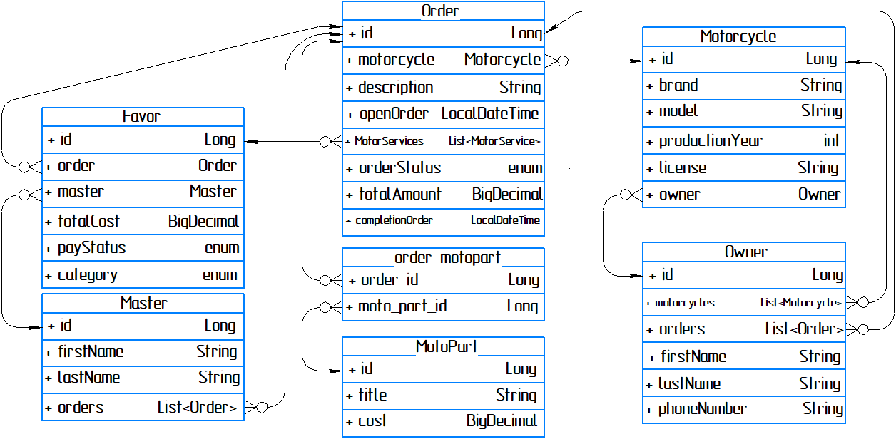

# MotoService

<h3>To launch app:</h3>
- pull this project  
- create schema motorcycle_service in postgreSQL DB  
- configure file applicationi.property and make a connection
- open terminal and run 'mvn clean package' command  
- IMPORTANT! follow db/changelog/db.changelog-master.yaml and uncomment scripts which responsible for filling tables with data  
- run app  
- open http://localhost:8080/swagger-ui/#/  
- now you can invoke GET: /orders/total-amount/{orderId} endpoint (order id is 3)  
- according to 'legend' the client agree with the cost, so you can change order status on 'CONFIRMED_SUCCESS'  
  (its automatically assign completionOrderData and fetch data into DB)  
- change order status on 'PAID'  
- now you can invoke GET: /masters/salary/{masterId} (there were two masters working on this order, so id is 1 and 2 respectively)  
- wou will obtain their salaries for all orders that has status 'PAID'. Needless to say if its orders includes  
  relevant favors, I mean favors with their id and status 'NOT_PAID'. All discounts (according origin task were implemented)  

<h3>DataBase structure:</h3>

<h3>Project description:</h3>
MotorcycleService will be in handy for accounting, saving data concerning clients or their discount, or etcetera...  
Its called to automate process of order leading, maintenance and simplify accounting order total amount  

MASTER CONTROLLER  
POST: /masters/create : just create a new master  
PUT: /masters/update : update it if you made a mistake  
GET: /masters/order-list/{masterId} : to obtain a list of all master's orders  
GET: /masters/salary/{masterId} : you can obtain master's salary by master_id. Mind you, after invoke this  
request, all relevant favors for this master will check their status on 'PAID'. You also have to take in  
mind, that only orders with status 'PAID' will be considered for this operation.  

MOTORCYCLE CONTROLLER  
POST: /motorcycles/create : just create a new motorcycle  
PUT: /motorcycles/update : update data if it, for example, changed license or etcetera  

OWNER CONTROLLER  
POST: /owners/create : just create a new owner  
PUT: /owners/update : update, if owner changed phone number  
GET: /owners/order-list/{id} : obtain a list of orders by owner's id  

ORDER CONTROLLER  
POST: /orders/create : just create a new order  
POST: /orders/add-moto-part : having created an order you can add some moto parts by id  
PUT: /orders/update : update it if some original data were changed  
PUT: /orders//change-status : you should invoke this endpoint if order's status changed to  
'CONFIRMED_SUCCESS' or 'CONFIRMED_FAIL'. It also has sense to switch status on 'PAID' after  
client paid his order off. Remember that only orders with status 'PAID' considered on to  
calculate master's salary  
GET: /orders/total-amount/{orderId} : calculate total amount for order by id. If there was a  
diagnostic procedure besides favors claimed to repair, its automatically will be switch on free  
'status'. I mean almost free (if client confirmed to repair, procedure of diagnostic costs 1 UAH)  

FAVOR CONTROLLER  
POST: /favors/create : create a new favor  
PUT: /favors/update : update favor procedure  
PUT: /favors/change-status : change status. But honestly it isn't sense (after calculating  
master's salary it will change its status automatically). So be careful with it!  

MOTO-PART CONTROLLER  
POST: /moto-parts/create : create a new moto part  
PUT: /moto-parts/update : update it if you made a mistake with cost, for example  

<h3>In this APP were used such technologies like:</h3>
- org.apache.maven, version 4.0.0 
- java, version 17 
- org.hibernate 
- spring boot 
- liquibase 
